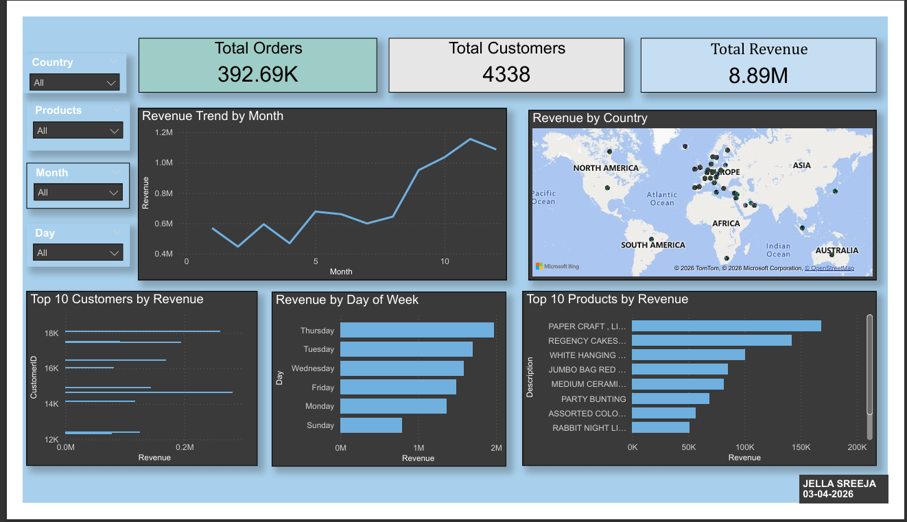
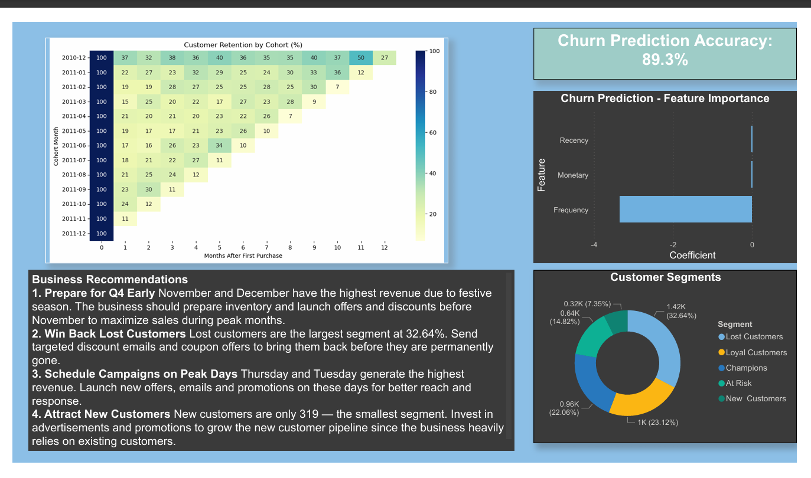

# Online Retail Data Analysis Project

# Overview
An end to end data analysis project on 541,909 retail transactions from a UK based online store covering December 2010 to December 2011. The project covers the complete data analysis pipeline from raw data cleaning to machine learning based churn prediction.
##  Live ML App
 https://onlineretailanalysis-ypsrhpy5zcpcdvhbeeprin.streamlit.app/

Interactive web application to predict customer churn using RFM values.

# Dataset
- Source: Kaggle — Online Retail Dataset
- Size: 541,909 rows, 8 columns
-Period: December 2010 — December 2011
- Features: InvoiceNo, StockCode, Description, Quantity, InvoiceDate, UnitPrice, CustomerID, Country

# Project Structure

online-retail-analysis/
│
├── data/
│   └── Online Retail.xlsx          # Raw dataset
│
├── Online_Retail_Analysis.ipynb     # Main Python notebook
├── cleaned_online_retail.csv       # Cleaned dataset
├── rfm_segments.csv                # RFM customer segments
├── cohort_retention.csv            # Cohort retention matrix
├── feature_importance.csv          # Churn model feature importance
├── cohort_heatmap.png              # Cohort analysis visualization
├── OnlineRetail_Sales_DashBoard.pbix  # PowerBI dashboard
└── README.md                       # Project documentation
# Dashboard Preview

# Pipeline
Raw Data → Data Cleaning → EDA → RFM Analysis → Cohort Analysis → Churn Prediction → PowerBI Dashboard

# 1. Data Cleaning
- Identified and separated 3 types of negative quantity rows — cancellations, stock adjustments and unknown entries
- Removed 5,268 duplicate rows
- Handled 135,080 missing CustomerIDs contextually — kept for revenue analysis, excluded for customer analysis
- Removed rows with zero UnitPrice and unknown descriptions
- Fixed CustomerID dtype from float64 to Int64
- Created Revenue column — Quantity × UnitPrice

# 2. Exploratory Data Analysis
- Monthly revenue trend — revenue peaks in November (highest) and December
- Top 10 products — predominantly home decoration and gift items
- Top 10 customers — customer 14646 is highest spender
- Revenue by country — UK dominates, Netherlands and EIRE lead internationally
- Day of week — Thursday and Tuesday are peak sales days
- Repeat vs one time buyers — 65.6% are repeat customers

# 3. RFM Analysis
- Segmented 4,338 customers into 5 groups
- Champions: 957, Loyal: 1,003, At Risk: 643, New: 319, Lost: 1,416
- Lost customers form the largest segment indicating a retention problem

# 4. Cohort Analysis
- Tracked customer retention month over month since first purchase
- Retention drops to 15-37% after month 1 then stabilizes at 20-30%
- December 2010 cohort shows strongest retention throughout the year

# 5. Churn Prediction
- Built Logistic Regression model to predict customer churn
- Achieved 89.3% accuracy
- Frequency is the strongest predictor of churn (coefficient -3.34)
- Customers who buy frequently are significantly less likely to churn

# 6. PowerBI Dashboard
- 2 page interactive dashboard
- Page 1 — Sales Overview with KPI cards, revenue trend, country map, top products and customers
- Page 2 — Advanced Analysis with cohort heatmap, churn accuracy and feature importance

# Key Findings
- Total Revenue: £8.89M across the full year
- Total Orders: 392,690
- Total Customers: 4,338
- November is the highest revenue month
- UK generates 83% of total revenue
- 65.6% of customers are repeat buyers
- Frequency is the strongest churn predictor

# Business Recommendations
1. Prepare inventory and promotions ahead of November and December to maximize Q4 revenue
2. Launch win-back campaigns targeting 1,416 lost customers with discount offers
3. Introduce loyalty rewards for 957 Champion customers to maintain engagement
4. Increase marketing in Netherlands and EIRE — strongest international markets
5. Schedule campaigns on Tuesdays and Thursdays for maximum reach
6. Focus retention strategy on increasing purchase frequency to reduce churn
7. Invest in customer acquisition — New Customers segment is critically small at 319

# Deployment

The churn prediction model has been deployed as an interactive web application using Streamlit Cloud.
Users can input:
- Recency (days since last purchase)
- Frequency (number of orders)
- Monetary (total amount spent)
The app predicts:
- Customer churn (High / Low)
- Probability of churn
🔗 Live App: https://onlineretailanalysis-ypsrhpy5zcpcdvhbeeprin.streamlit.app/

##  Note
Initially developed as a local data analysis and ML project, and later enhanced by deploying it as a live web application.
# Tools Used
- **Python** — Pandas, NumPy, Matplotlib, Seaborn, Scikit-learn
- **PowerBI Desktop** — Interactive dashboard
- **Jupyter Notebook / VS Code** — Development environment

# Author
Jella Sreeja
April 2026
